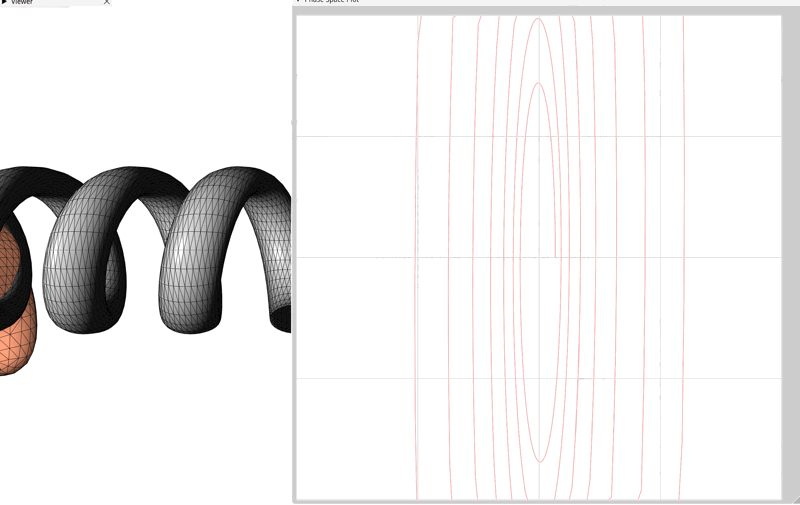
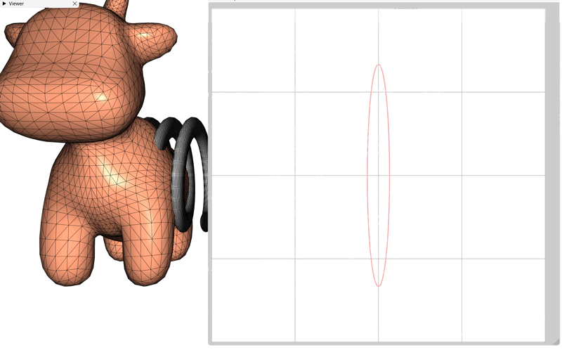
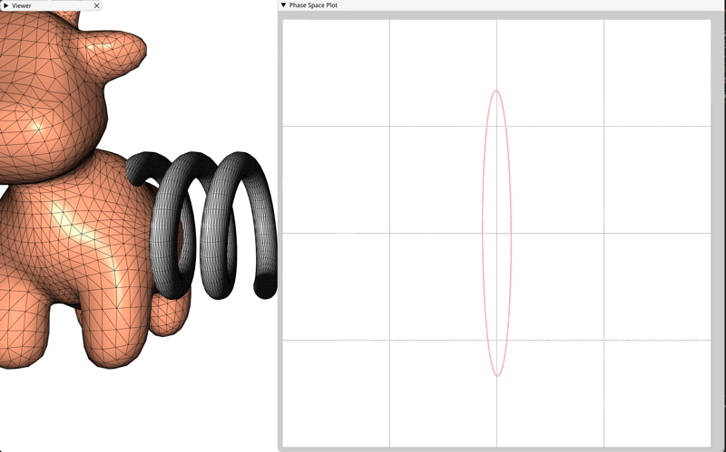

# Physics-Based Animation – Time Integration of Mass-Spring Systems in One Dimension

> **To get started:** Clone this repository and all its [submodule](https://git-scm.com/book/en/v2/Git-Tools-Submodules) dependencies using:
> 
>     git clone --recursive https://github.com/dilevin/CSC2549-a1-mass-spring-1d.git

**Do not fork:** Clicking "Fork" will create a _public_ repository. If you'd like to use GitHub while you work on your assignment, then mirror this repo as a new _private_ repository: https://stackoverflow.com/questions/10065526/github-how-to-make-a-fork-of-public-repository-private

## Introduction

Welcome to Physics-Based Animation. This assignment has two purposes, (1) to familiarize you with the development tools used for assignments in the course and (2) to introduce you to some basic physics simulation concepts in one-dimension (1D).  

### Prerequisite installation

On all platforms, we will assume you have installed cmake and a modern c++
compiler on Mac OS X[¹](#¹macusers), Linux[²](#²linuxusers), or
Windows[³](#³windowsusers).

We also assume that you have cloned this repository using the `--recursive`
flag (if not then issue `git submodule update --init --recursive`). 

**Note:** We only officially support these assignments on Ubuntu Linux 18.04 (the OS the teaching labs are running) and OSX 10.13 (the OS I use on my personal laptop). While they *should* work on other operating systems, we make no guarantees. 

**All grading of assignments is done on Linux 18.04**

### Layout

All assignments will have a similar directory and file layout:

    README.md
    CMakeLists.txt
    main.cpp
    include/
      function1.h
      function2.h
      ...
    src/
      function1.cpp
      function2.cpp
      ...
    data/
      ...
    ...

The `README.md` file will describe the background, contents and tasks of the
assignment.

The `CMakeLists.txt` file setups up the cmake build routine for this
assignment.

The `main.cpp` file will include the headers in the `include/` directory and
link to the functions compiled in the `src/` directory. This file contains the
`main` function that is executed when the program is run from the command line.

The `include/` directory contains one file for each function that you will
implement as part of the assignment.

The `src/` directory contains _empty implementations_ of the functions
specified in the `include/` directory. This is where you will implement the
parts of the assignment.

The `data/` directory contains _sample_ input data for your program. Keep in
mind you should create your own test data to verify your program as you write
it. It is not necessarily sufficient that your program _only_ works on the given
sample data.

## Compilation

This and all following assignments will follow a typical cmake/make build
routine. Starting in this directory, issue:

    mkdir build
    cd build
    cmake ..

If you are using Mac or Linux, then issue:

    make

If you are using Windows, then running `cmake ..` should have created a Visual Studio solution file
called `a1-mass-spring-1d.sln` that you can open and build from there. Building the raster project will generate an .exe file.

Why don't you try this right now?

## Execution

Once built, you can execute the assignment from inside the `build/` using 

    ./a1-mass-spring-1d

## Background

Physics-based animation leverages techniques from classical mechanics, numerical solutions of partial and ordinary equations (and more !!). As this course progresses you will learn how to use such methods to produce compelling animations of a wide variety of real-world phenomena. This assignment will lay common mathematical and technical foundation on which to build some seriously cool stuff. 

**Github does not render the math in this Markdown. Please look at README.html to see the equations in their proper form**

<!-- mention where things are implemented inline -->
### Newton's Second Law of Motion

Isaac Newton famously described the near-earth motion of objects using three laws:  

1. *every object will remain at rest or in uniform motion in a straight line unless compelled to change its state by the action of an external force*  
2. *the force acting on an object is equal to the time rate-of-change of the momentum*  
3. *for every action there is an equal and opposite reaction*  
   
The first law simply states an object cannot change its velocity unless a force acts on it. The third law is used to imply conservation of momentum. It is the second law that implies a mathematical model we can use to create moving pictures. That mathematical model can be expressed in 1D by the very famous formula

$$ ma = f $$.

Here $m$ is the scalar mass of the object (typically measured in kg), $a$ is the acceleration of the object (typically measured in meters per second squared) and $f$ are the forces acting on the object (measured in Newtons, what an ego!).

Because acceleration is the rate-of-change of velocity over time, and velocity is the rate-of-change of position over time, we can rewrite this in all its differential equation glory as

$$ m\ddot{x} = f $$,

where we use $\ddot{x}$ to mean $\frac{d^2x}{dt^2}$.

Before we get busy solving this differential equation numerically, we are going to introduce **one of the the most important concepts on this course** -- the variational perspective on classical mechanics. 

### The Variational Perspective  

We can thank [Leibniz](https://en.wikipedia.org/wiki/Gottfried_Wilhelm_Leibniz) for introducing the quantities of kinetic and potential energy. As the course progresses you will see how understanding dynamic motion in terms of these quantities makes it easy to extend Newton's Second Law to a wide variety of applications. Here we will get some intution in 1D by breifly reviewing how it arises from a variational principle.

It was Hamilton who identified the approriate variational principle for describing mechanics, called [**the Principle of Least Action**](https://en.wikipedia.org/wiki/Principle_of_least_action). The Principle of Least Action asserts that the trajectory of an object over time, is one that minimizes the integral, over time, of the difference between the kinetic and potential energy, or 

$$ \mathbf{q}\left(t\right) = \arg\min_{\mathbf{q}}\underbrace{\int_{t0}^{t1} T\left(\mathbf{q}, \dot{\mathbf{q}}\right)-V\left(\mathbf{q}, \dot{\mathbf{q}}\right) dt}_{\mbox{Action}} $$,

In this course we use $T$ to represent the kinetic energy of an object and $V$ to represent its potential energy. The mysterious quantity $\mathbf{q}$ are the "generalized coordinates" of the system and, briefly all I'll say is that they describe the "configuration" of the mechanical system (don't panic, more soon!).

Note: The quantity $T-V$ is typically referred to as the Lagrangian, named after [Lagrange](https://en.wikipedia.org/wiki/Joseph-Louis_Lagrange).  

Finding the conditions under which the Principle of Least Action is stationary can be done using the Calculus of Variations (Top 3 in the most useful things to know if you are a graphics researcher!). It turns out that if $\mathbf{q}\left(t\right)$ satisfies the differential equations (the Euler-Lagrange Equations)

$$ \frac{d}{dt}\left(\frac{\partial L}{\partial \dot{\mathbf{q}}}\right) = -\frac{\partial L}{\partial \mathbf{q}}$$,

then $\mathbf{q\left(t\right)}$ is a physically valid trajectory. In this way we can see that as long as we can define appropriate generalized coordinates along with kinetic and potential energies we can describe the motion of a physical system. This 

As physics simulation connoiseurs, this makes our job conceptually easy, we just need to solve this differential equation. Let's look at how we do that for our 1D mass spring system (and thereby get a good grade on this assignment). 

### The 1D Mass-Spring System

You will soon see that the variational machinery above gives us a cookbook method for describing physics-based motion. To do this we are going to need to define three quantities

1. Our nebulous $\mathbf{q}$'s
2. The kinetic energy of  mass spring, $T$
3. The potential energy of mass spring, $V$

The first task is to choose $\mathbf{q}$ so that all permissable positions (the configurations) of our mass-spring system can be written as $\mathbf{x}\left(t\right) = \mathbf{f}\left(\mathbf{q}\left(t\right)\right)$. Here $\mathbf{x\left(t\right)}$ is just the position of the center of our particle in 1D Euclidean space and so an easy choice for $\mathbf{q} = \mathbf{x}$.

Having picked some reasonable generalized coordinates we can now define $T$ and $V$. In 1D, the definition of kinetic energy is likely very familiar 

$$ T = \frac{1}{2}m\dot{\mathbf{x}}^2 $$,

where $m$ is the mass of the particle. 

The potential energy in this system comes from the titular spring. Here we can use a simple quadratic energy defined as

$$ V = \frac{1}{2}k\mathbf{x}^2$$,

where $k$ is the "stiffness of the spring", the proportionality constant that converts a measure of stretch or compression to an energy.

From the Euler-Lagrange equations we can show that the motion of this single mass and spring satisfies

$$m\ddot{\mathbf{x}} = -k\mathbf{x},$$

in other words, it satisfies Newton's Second Law in its standard form, with the forces given by [Hooke's Law](https://en.wikipedia.org/wiki/Hooke%27s_law). While this example might seem trivial, later in the course we'll see examples where applying the Principle of Least Action will be crucial for deriving equations of motion for more complicated objects.

### Numerical Time Integration 

A standard approach to solving the *second-order* differential equation above is to transform it into the coupled first-order system

$$\begin{eqnarray*} 
m\dot{\mathbf{v}} &=& -k\mathbf{x} \\ 
\dot{\mathbf{x}} &=& \mathbf{v}  
\end{eqnarray*}$$

where we introduce the velocity of the mass-spring system as a seperate variable and the second equation enforces the approriate relationship between position and velocity. Now, given some initial position and velocity (together called the intial state) for the mass-spring system, our goal is to compute subsequent states which represent the trajectory of the particle over time. This process is called time integration because we are *integrating* the first-order differential equation, across time, to create the solution. Because almost all the systems we deal with will not admit analytical solutions, we are going to do this numerically. Let's take a look at four of the most common integration schemes. 

### Numerical Solution Attempt #1: Forward Euler Integration

Forward Euler is the simplest algorithm for numerical integration of an ordinary differential equation. It's so popular that it even got a shout out in the blockbuster movie [Hidden Figures](https://www.insidescience.org/news/exploring-math-hidden-figures). Sadly, we will quickly see that, for elastic objects, like springs, it has some pretty serious downfalls.

Forward Euler discretizes our differential equation by replacing all derivatives with first-order, finite difference approximations of the form 

$$ \dot{y}^{t} = \frac{y^{t+1} - y^{t}}{\Delta t},$$

where we use superscripts to indicate whether we are accessing a variable at the current ($t$) or next ($t+1$) timestep. By rearranging we see that

$$y^{t+1} = y^{t} + \Delta t \dot{y}^{t}$$

Following the same basic approach for our coupled, first-order system yields a scheme to compute an updated state for our mass spring system.

### Attempt #2: Runge-Kutta Integration

**COMING SOON**

### Attempt #3: Implicit Integration 
**COMING SOON**

### Attempt #4: Symplectic Euler
**COMING SOON**

## Tasks

In this assignment we'll primarily be interested in the energetic behaviour of our mass-spring system when integrated with the four time integrators described above. The user interface for this assignment includes a window which displays the trajectory of the mass-spring system in the [*phase plane*](https://en.wikipedia.org/wiki/Phase_plane) of the mass spring system over time. Images of the correct phase plane trajectories are included below.  

### Groundrules

Implementations of nearly any task you're asked to implemented in this course can be found online. Do not copy these and avoid googling for code; instead, search the internet for explanations. Many topics have relevant wikipedia articles. Use these as references. Always remember to cite any references in your comments.

### src/dV_spring_particle_particle_dq.cpp

Compute the derivative of the potential energy with respect to the generalized coordinates. 

### src/d2V_spring_particle_particle_dq2.cpp

Compute the second derivative of the potential energy with respect to the generalized coordinates.

### include/forward_euler.h 

Advance the mass spring system one step forward in time using the Forward Euler algorithm.

### include/runge_kutta.h

Advance the mass spring system one step forward in time using the $4^{th} order$ Runge-Kutta algorithm.

To run the assignment code with the Runge-Kutta algorithm use

    ./a1-mass-spring-1d 'rk'

### include/backward_euler.h

Advance the mass spring system one step forward in time using the Backward Euler algorithm

To run the assignment code with the Runge-Kutta algorithm use

    ./a1-mass-spring-1d 'be'

### include/symplectic_euler.h 

Advance the mass spring system one step forward in time using the Symplectic Euler algorithm

To run the assignment code with the Runge-Kutta algorithm use

    ./a1-mass-spring-1d 'se'

